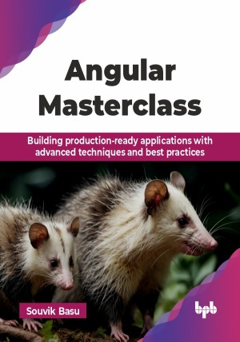

# Angular Masterclass

Building production-ready applications with advanced techniques and best practices.

This is the repository for [Angular Masterclass
](https://bpbonline.com/products/angular-masterclass?variant=44317747609800),published by BPB Publications.

## About the Book
Angular is a popular JavaScript framework that empowers developers to create single-page applications (SPAs) with ease. This comprehensive guide is designed to equip you with the skills and knowledge to become a proficient Angular developer, even if you are starting from scratch.

This book offers a step-by-step guide to mastering Angular development. It starts with setting up your environment, using Angular CLI for efficient project management, and creating reusable components that form the core of any Angular app. You will learn data binding to connect data with your user interface and routing to guide users through your app’s sections. The book covers TypeScript basics, Angular’s primary language, and component lifecycle hooks for managing behavior at different stages. Advanced topics include handling user input with reactive forms, testing for quality assurance, and deploying your application effectively. Additionally, it covers styling to create attractive designs and accessibility practices to ensure your applications are usable for everyone.

By the end of this masterclass, you will be well-equipped to confidently build modern, interactive, and user-friendly web applications using the power of Angular.

## What You Will Learn
• Optimize Angular applications for performance and responsiveness.

• Utilize advanced Angular features like lazy loading and preloading.  

• Optimize applications using change detection strategies and performance profiling.  

• Debug production issues effectively with monitoring, telemetry tools, and error-handling mechanisms.

• Implement internationalization (i18n) for multilingual applications. 

• Explore component lifecycle and its management.
